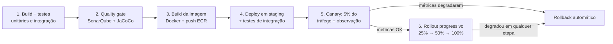

# Proposta de pipeline CI/CD

> Requisito do desafio: propor uma pipeline com uma estratégia de deploy que
> mitigue o risco de um bug impactar todos os clientes de uma vez.

## Estratégia escolhida: Canary Release

**Canary**, não blue/green. Com canary, um bug na nova versão afeta apenas a
fatia inicial de tráfego (ex.: 5%) e o rollback é acionado automaticamente por
métricas antes de o problema se espalhar. Com blue/green, a troca é 100% de uma
vez — se um bug só aparece sob carga real de produção (o que boa parte dos bugs
de sistemas financeiros faz: race conditions, timeouts de conexão com o banco
sob concorrência, etc.), todos os clientes são impactados simultaneamente antes
que qualquer alarme dispare. Canary troca "detectar rápido" por "expor pouco",
o que é o perfil certo para uma API de autorização de transações, onde cada
falha tem custo direto (débito indevido, transação perdida).

## Pipeline (GitHub Actions)

### 1. Build + testes
`mvn clean verify` — roda os testes unitários (`AccountTest`, `TransactionServiceTest`,
`AccountServiceTest`), o teste de concorrência com Testcontainers
(`ConcurrentDebitTest`) e os testes de API (`TransactionControllerTest`).
Falha aqui interrompe a pipeline — nenhum artefato é publicado.

### 2. Quality gate
SonarQube (ou equivalente) para análise estática (bugs, code smells,
vulnerabilidades) e JaCoCo para cobertura de testes, com um limiar mínimo
(ex.: 80%) como gate obrigatório — não apenas informativo.

### 3. Build da imagem + push
Build do `Dockerfile` multi-stage já presente no repositório, tag com o SHA do
commit, push para o Amazon ECR. Nunca usar `:latest` como tag de deploy — cada
deploy referencia uma imagem imutável e rastreável.

### 4. Deploy em staging + testes de integração
Deploy da imagem em um ambiente de staging (mesma topologia de produção, escala
menor), seguido de testes de integração contra a API real (os cenários do
`requests.http`: crédito, débito aprovado, débito recusado, idempotência,
corner cases de validação).

### 5. Canary — 5% do tráfego
No ECS/API Gateway, direcionar 5% do tráfego de produção para a nova task
definition, mantendo 95% na versão anterior. Observar por uma janela de tempo
(ex.: 15-30 minutos) as métricas já expostas pela aplicação via
`/actuator/prometheus`:
- taxa de erro 5xx
- latência p99 de `transaction.authorization.latency`
- taxa de transações `FAILED` fora do padrão histórico (pode indicar bug na
  regra de negócio, não só infraestrutura)
- estado do circuit breaker `db-persistence` (se abrir durante o canary, é sinal
  de regressão na camada de persistência)

### 6. Rollout progressivo ou rollback automático
Se as métricas do canary permanecerem dentro do baseline: promove
progressivamente (25% → 50% → 100%), repetindo a observação em cada etapa.
Se qualquer etapa degradar: rollback automático para a versão anterior
(basta redirecionar 100% do tráfego de volta — a versão anterior nunca foi
desligada), sem intervenção manual, e alerta para o time.

## Por que isso importa especificamente aqui

A aplicação já expõe os sinais que uma pipeline de canary precisa observar:
Micrometer/Prometheus para métricas de negócio (contagem de transações por
status, latência) e de infraestrutura (circuit breaker), além do
`/actuator/health`. Sem esses sinais, "observar o canary" seria apenas olhar
CPU/memória — insuficiente para pegar um bug de regra de negócio (ex.: uma
regressão que aprovasse débitos que deveriam ser recusados).
