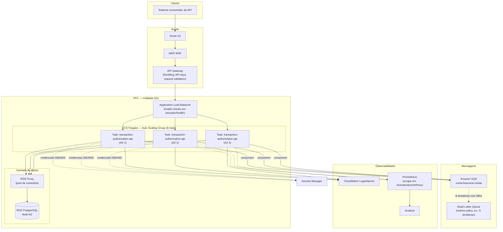

# Diagrama de deploy em cloud pública (AWS)

> Requisito do desafio: mostrar o que seria necessário para levar esta aplicação
> para produção em uma cloud pública — API Gateway, load balancers, orquestrador
> de containers, compute type, etc. O exemplo abaixo usa AWS porque a aplicação
> já integra com SQS via AWS SDK v2, mas as peças têm equivalentes diretos em
> GCP/Azure.

## Diagrama

## Componentes e justificativa

| Componente | Papel | Por quê |
|---|---|---|
| **Route 53** | DNS | Roteamento e health-check de domínio; suporta failover multi-região se necessário no futuro. |
| **AWS WAF** | Firewall de aplicação | Bloqueia payloads maliciosos antes de chegar na API (SQLi, XSS, rate abuse). |
| **API Gateway** | Borda gerenciada | Throttling, API keys/usage plans, validação de payload, e um ponto único para expor a API sem acoplar clientes ao ALB interno. |
| **ALB** | Load balancer L7 | Distribui tráfego entre as tasks Fargate em múltiplas AZs; health check no `/actuator/health` já exposto pela aplicação. |
| **ECS Fargate** | Orquestração de containers, serverless | Sem gestão de servidores/nós (diferente de EKS), auto scaling por CPU/memória ou fila (SQS depth), reinício automático de tasks não saudáveis. Alternativa: EKS, se a organização já padronizar Kubernetes — não é o caso aqui, então Fargate reduz overhead operacional. |
| **RDS PostgreSQL Multi-AZ** | Banco relacional gerenciado | Mesma engine usada localmente (Postgres 16); Multi-AZ dá failover automático. Lock pessimista (`SELECT FOR UPDATE`) usado no código depende de um banco relacional real. |
| **RDS Proxy** | Pool de conexões gerenciado | Evita esgotar conexões do Postgres quando o número de tasks Fargate escala horizontalmente (cada task já usa um pool HikariCP próprio). |
| **SQS + DLQ** | Fila do evento `conta-bancaria-criada` | Já é a fila do desafio; em produção adicionaria uma redrive policy para DLQ após N falhas, evitando reentrega infinita de uma mensagem corrompida (gap documentado no README). |
| **CloudWatch** | Logs e alarmes | Logs centralizados das tasks Fargate; alarmes em métricas de erro/latência. |
| **Prometheus + Grafana** | Métricas e dashboards | A aplicação já expõe `/actuator/prometheus` (Micrometer); Prometheus faz scrape, Grafana visualiza (latência de autorização, taxa de transações FAILED, throughput do consumidor SQS). |
| **Secrets Manager** | Segredos | Credenciais do RDS e da AWS injetadas nas tasks Fargate como secrets, nunca em variáveis de ambiente em texto plano no `docker-compose`/pipeline. |

## Compute type

Fargate (serverless, sem gestão de instâncias EC2) é o ponto de partida recomendado
para esta carga de trabalho: stateless, CPU/memória previsíveis, sem necessidade de
GPU ou hardware especializado. Se o custo por vCPU/hora do Fargate se tornar um
problema em alta escala sustentada, migrar para ECS sobre EC2 (ou EKS) com
instâncias reservadas/Savings Plans é o próximo passo natural — trade-off de menor
custo por overhead operacional maior.
